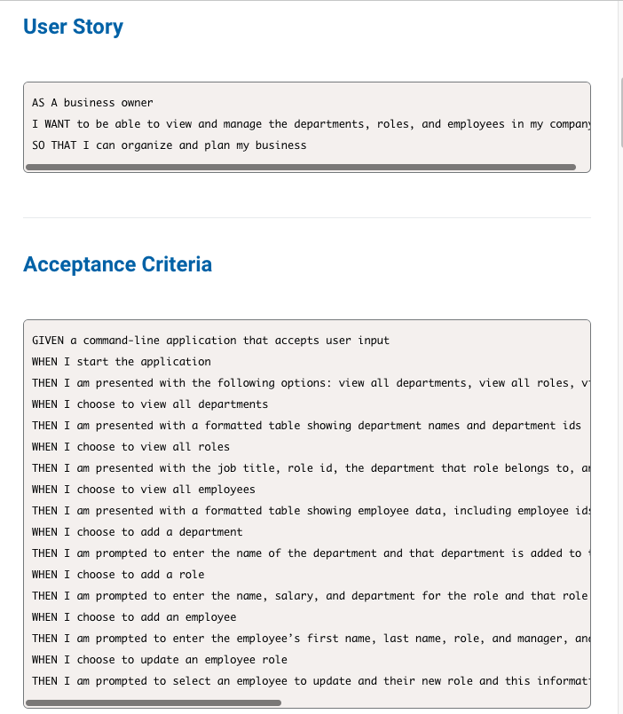
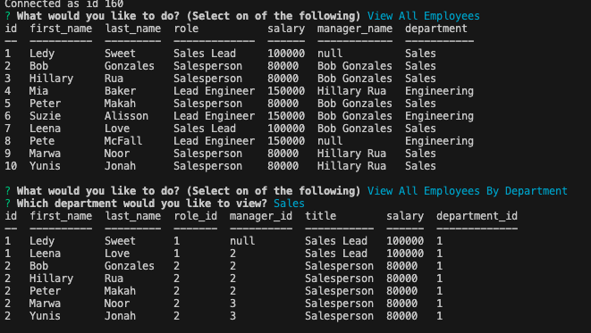
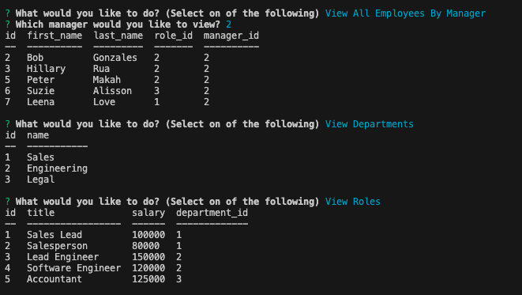

# employee-tracker

Manage your business, Track your employees!

## Description

This is a Command-Line application that allows business owners to manage their employees, departments and roles. 

User Story;

## Summary

This application is a Command-Line App that is usefull for business owners or companies to track their business. 
You can select to view the emloyees in your company as well as departments. You can add employees or update their roles, departments, salary, etc.. 

Code Snippets;

## Installation / Usage 

In order to install you need to Clone this repository to your local machine so you can use the application. 

Step 1 --> Clone Repository 

Step 2 --> Run MySQL in your terminal. (In order to run MySQL make sure you have installed MySQL / MySQL2)

Step 3 --> Run source schema.sql and source seeds.sql in your MySQL terminal. (Then Exit) 

Step 4 --> Run Node Index.js in bash shell and follow the commands. 

Step 5 --> Use any of the prompts provided to add or update employees, departments and roles! 

Step 6 --> After you are finished type "CTRL + C" / "Control + C" to exit. 

## License 

MIT License 

## Author 

Dilek Nuredin 

https://github.com/dileknrdn 
